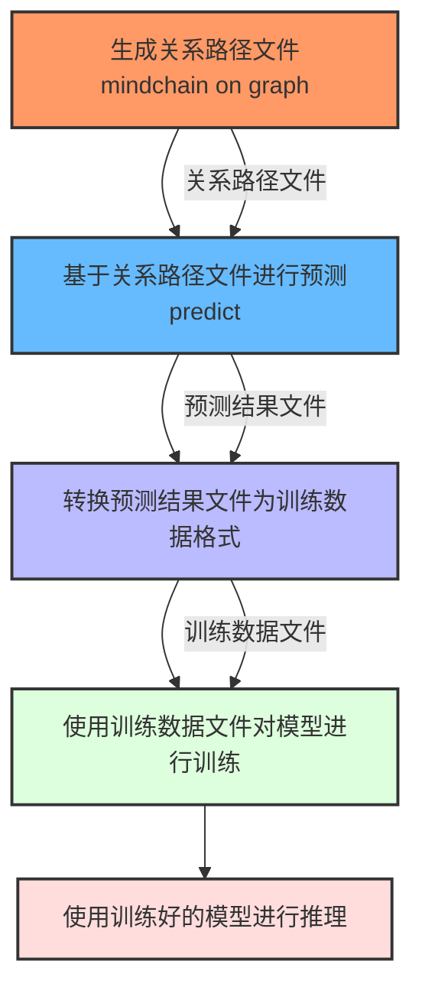
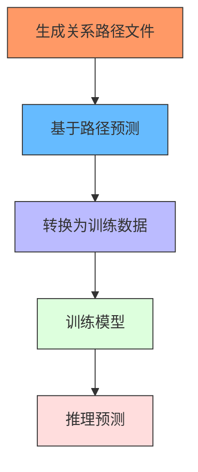
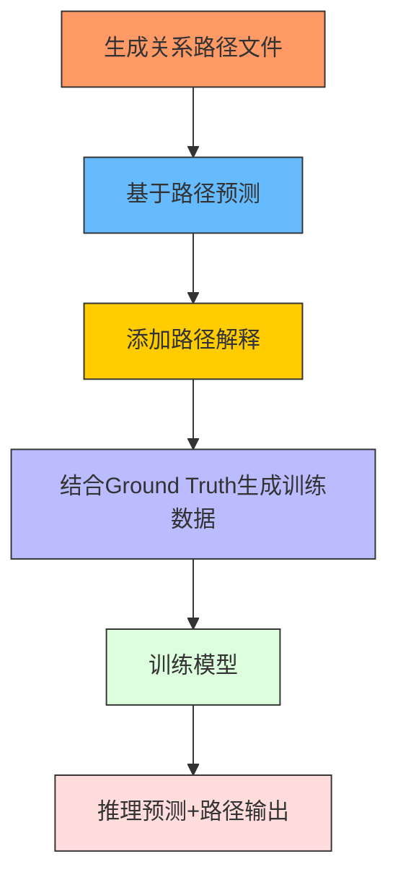
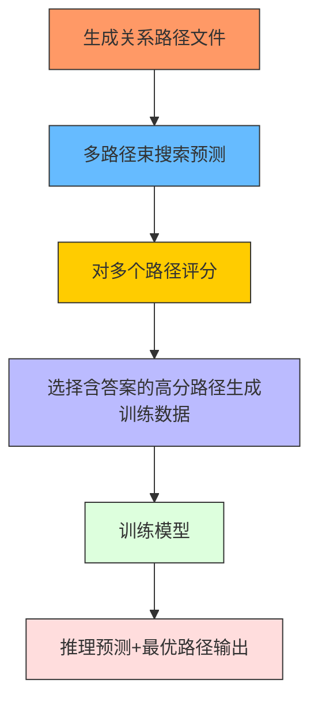

# 模型准确率对比
OKVQA
### **基座模型：qwen**

| 方法                     | 准确数量 / 总数   | 准确率    | 相比 Baseline 提升（百分点） | 相比 Baseline 提升百分比 |
|------------------------|-------------|--------|---------------------|-------------------|
| Baseline :未加systemtokn | 3802 / 5046 | 75.35% | —                   | —                 |
| 未训练 +systemtoken       | 3978 / 5046 | 78.83% | +3.48 pp            | +4.62%            |
| 训练集训练                  | 3830 / 5046 | 75.90% | +0.55 pp            | +0.57%            |
| RoG 方法                 | 4289 / 5046 | 84.99% | +9.64 pp            | +12.80%           |
| ROG训练方法1               | 3974 / 5046 | 78.75% | +3.40 pp            | +4.52%            |
| ROG训练方法2               | 4550 / 5046 | 90.17% | +14.82 pp           | +19.67%           |
| ROG训练方法3               | 4702 / 5046 | 93.18% | +17.83 pp           | +23.67%           |

### **基座模型：gemma**

| 方法                          | 准确数量 / 总数   | 准确率  | 相比 Baseline 提升（百分点） | 相比 Baseline 提升百分比 |
|-----------------------------|-------------|------|---------------------|-------------------|
| Baseline（未训练未加systemtokens） | 3927 / 5046 | 77.82% | —                   | —                 |
| 未训练 + systemtokens          | 3868 / 5046 | 76.66% | -1.16 pp            | -1.49%            |
| 训练（普通 LoRA）                 | 3501 / 5046 | 69.38% | -8.44 pp            | -10.85%           |
| RoG 方法                      | 4031 / 5046 | 79.89% | +2.07 pp            | +2.66%            |
| ROG训练方法3                    | 4654 / 5046   | 92.23%     | +14.41 pp           | +18.51%           |

### **基座模型：llama**

| 方法                          | 准确数量 / 总数   | 准确率    | 相比 Baseline 提升（百分点） | 相比 Baseline 提升百分比 |
|-----------------------------|-------------|--------|---------------------|-------------------|
| Baseline（未训练未加systemtokens） | 3543 / 5046 | 70.21% | —                   | —                 |
| 未训练 + systemtokens          | 3576 / 5046 | 70.87% | +0.66 pp            | +0.94%            |
| 训练（普通 LoRA）                 | 3458 / 5046 | 68.53% | -1.68 pp            | -2.39%            |
| RoG 方法                      | 3702 / 5046 | 73.36% | +3.15 pp            | +4.49%            |
| ROG训练方法3                    | 4676 / 5046 | 92.67% | +22.46pp            | 31.98%            |

# 一.用户想要用ROG
直接对验证集或者单个的KQA问题
 
    -1.生成关系路径1.jsonl
    -2.基于1.jsonl进行ROG预测，2.jsonl

# 二。用户想获得一个能直接用ROG方法的模型

1.生成关系路径1.jsonl
2.基于1.jsonl进行ROG预测，2.jsonl
3.2.jsonl转化为2.json->train
4.基于2.json训练
5.基于训练好的模型进行推断
对训练集进行运行

# ROG方法改进
1.基于最初的ROG代码，简单的将预测结果以及推断的模型进行训练，从而获得类似标准答案风格的可以进行路径预测的模型，可解释性较差

2.在上述基础上更改代码实现了简单的路径解释，并给出基于groundtruth的标准预测。

3.引入了评分机制，通过束搜索同时生成多路径，并基于多路径生成多个预测，并在处理数据集时将最高分以及含有答案的预测放入其中，使得生成的答案具有完整的路径解释以及实际答案预测。

# 2.quickstart
