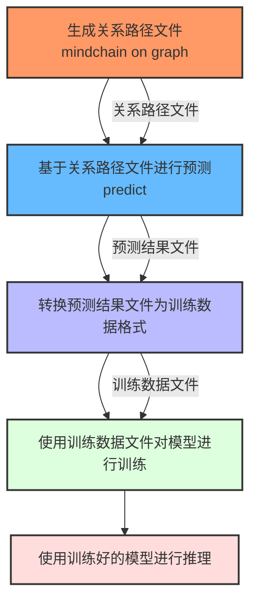
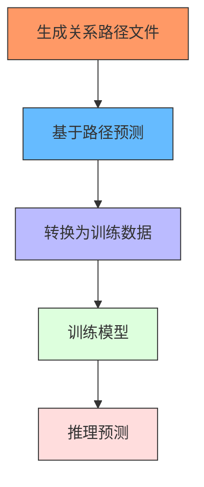
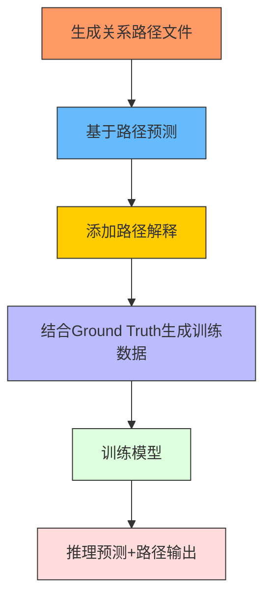
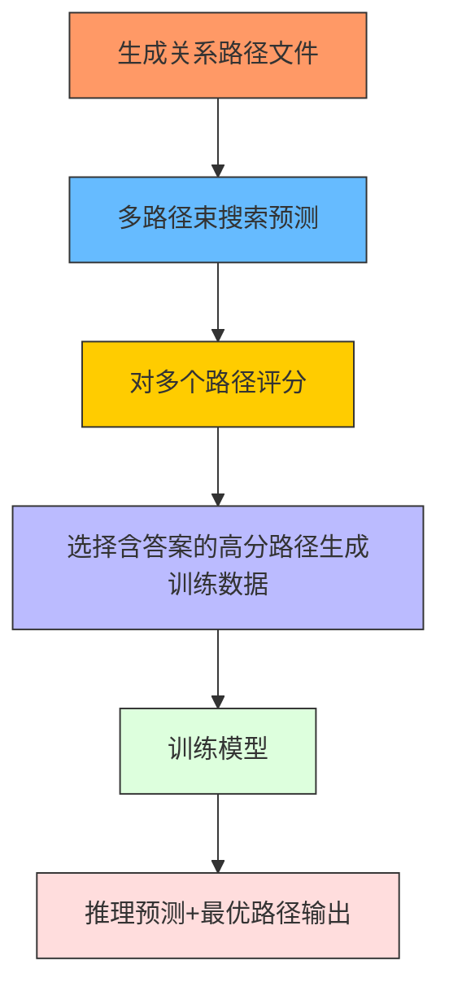

# 模型准确率对比
## OKVQA

### 闭源先进模型：gemini2.5-flash:4132/5046，正确率81.89%。

### 开源先进模型：inclusionAI/M2-Reasoning：4067 / 5046， 正确率确率80.60%。

### **基座模型：qwen**

| 方法                   | 准确数量 / 总数   | 准确率    | 相比 Baseline 提升（百分点） | 相比 Baseline 提升百分比 |
|----------------------|-------------|--------|---------------------|-------------------|
| Baseline :未加systemtokn | 3802 / 5046 | 75.35% | —                   | —                 |
| 未训练 +systemtoken     | 3978 / 5046 | 78.83% | +3.48 pp            | +4.62%            |
| 训练集训练                | 3830 / 5046 | 75.90% | +0.55 pp            | +0.57%            |
| vRoG 方法              | 4289 / 5046 | 84.99% | +9.64 pp            | +12.80%           |
| ROG训练方法              | 3974 / 5046 | 78.75% | +3.40 pp            | +4.52%            |
| vROG训练方法2            | 4550 / 5046 | 90.17% | +14.82 pp           | +19.67%           |
| vROG训练方法3            | 4702 / 5046 | 93.18% | +17.83 pp           | +23.67%           |

### **基座模型：gemma**

| 方法                          | 准确数量 / 总数   | 准确率  | 相比 Baseline 提升（百分点） | 相比 Baseline 提升百分比 |
|-----------------------------|-------------|------|---------------------|-------------------|
| Baseline（未训练未加systemtokens） | 3927 / 5046 | 77.82% | —                   | —                 |
| 未训练 + systemtokens          | 3868 / 5046 | 76.66% | -1.16 pp            | -1.49%            |
| 训练（普通 LoRA）                 | 3501 / 5046 | 69.38% | -8.44 pp            | -10.85%           |
| vRoG 方法                     | 4031 / 5046 | 79.89% | +2.07 pp            | +2.66%            |
| vROG训练方法3                   | 4654 / 5046   | 92.23%     | +14.41 pp           | +18.51%           |

### **基座模型：llama**

| 方法                          | 准确数量 / 总数   | 准确率    | 相比 Baseline 提升（百分点） | 相比 Baseline 提升百分比 |
|-----------------------------|-------------|--------|---------------------|-------------------|
| Baseline（未训练未加systemtokens） | 3543 / 5046 | 70.21% | —                   | —                 |
| 未训练 + systemtokens          | 3576 / 5046 | 70.87% | +0.66 pp            | +0.94%            |
| 训练（普通 LoRA）                 | 3458 / 5046 | 68.53% | -1.68 pp            | -2.39%            |
| vRoG 方法                     | 3702 / 5046 | 73.36% | +3.15 pp            | +4.49%            |
| vROG训练方法3                   | 4676 / 5046 | 92.67% | +22.46pp            | 31.98%            |

相同的基座模型llama3.2-11b,[llama-cot](https://github.com/PKU-YuanGroup/LLaVA-CoT)的结果为：

3968/5046，准确率: 78.64%  

---

# 用户需求与解决方案

## 一、用户想要用ROG直接对验证集或者单个KQA问题进行处理

- 生成关系路径 `1.jsonl`
- 基于 `1.jsonl` 进行ROG预测，得到 `2.jsonl`

## 二、用户想获得一个能直接用ROG方法的模型



**步骤流程：**
1. 生成关系路径 `1.jsonl`
2. 基于 `1.jsonl` 进行ROG预测，得到 `2.jsonl`
3. 将 `2.jsonl` 转化为训练数据格式 `2_train.json`
4. 使用 `2_train.json` 对模型进行训练
5. 使用训练好的模型进行推断

---

# ROG方法改进

## 改进方案1：基础版ROG训练流程



该方案简单地将预测结果转化为训练数据并重新训练模型，但可解释性较差。

---

## 改进方案2：引入路径解释



此方案在基础之上增加了路径解释功能，并结合 Ground Truth 数据生成更高质量的训练样本。

---

## 改进方案3：多路径评分机制



本方案通过多路径生成与评分机制，提升了预测结果的多样性和准确性，并保证最终输出具有完整的路径解释。

---

# 快速开始指南 (Quickstart)

## 第0步：配置环境

```shell
conda env create --file environment.yml --name rog
conda activate rog
```

> **注意：** Flash Attention 可选安装，请参考其官方文档获取更多信息。

---

## 第一步：下载数据集并解压

```shell
pip install modelscope
modelscope download --dataset OmniData/OK-VQA --local_dir ./data
unzip ./data/*.zip
```

---

## 在此目录下运行推断代码

### 第一个脚本：生成关系路径（仅关键词）

请根据需要调整参数：

```shell
bash ./scripts/planning.sh 
```

### 第二个脚本：生成对应关系路径的推理结果

输入文件必须是上一步的输出文件：

```shell
bash ./scripts/rog-reasoning.sh
```

---

## 在此目录下进行ROG方法的模型训练

### 步骤1：生成关系路径（用于训练模式）

请根据需要调整参数并启用训练模式：

```shell
bash ./scripts/planning.sh 
```

### 步骤2：生成推理结果

输入文件必须是上一步的输出文件：

```shell
bash ./scripts/rog-reasoning.sh
```

### 步骤3：生成可用于训练的数据集

请修改文件路径以匹配上一步的输出文件：

```shell
python ./src/finetuning/generate.py
```

### 步骤4：进行模型训练

```shell
bash ./src/finetuning/train.sh
```

完成训练后，你将获得一个经过ROG训练的模型。

---

### 使用训练好的模型进行推理（可选）

可以直接使用如下命令进行验证：

```shell
python ./validatelora.py
```

---
