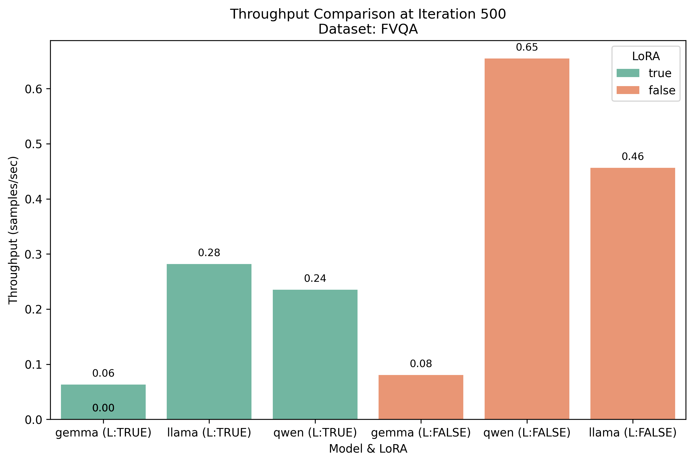
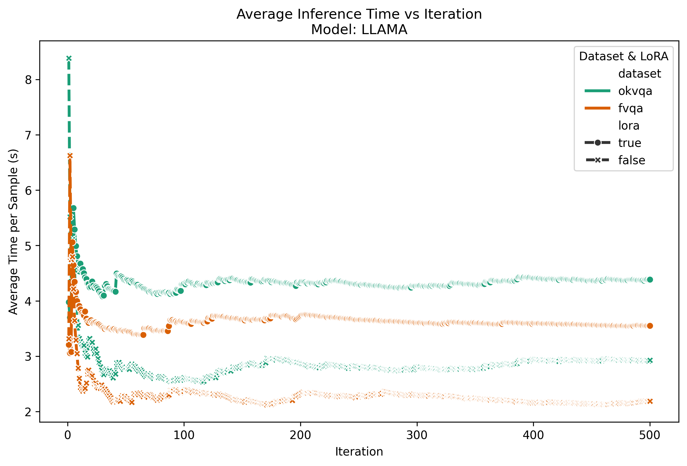
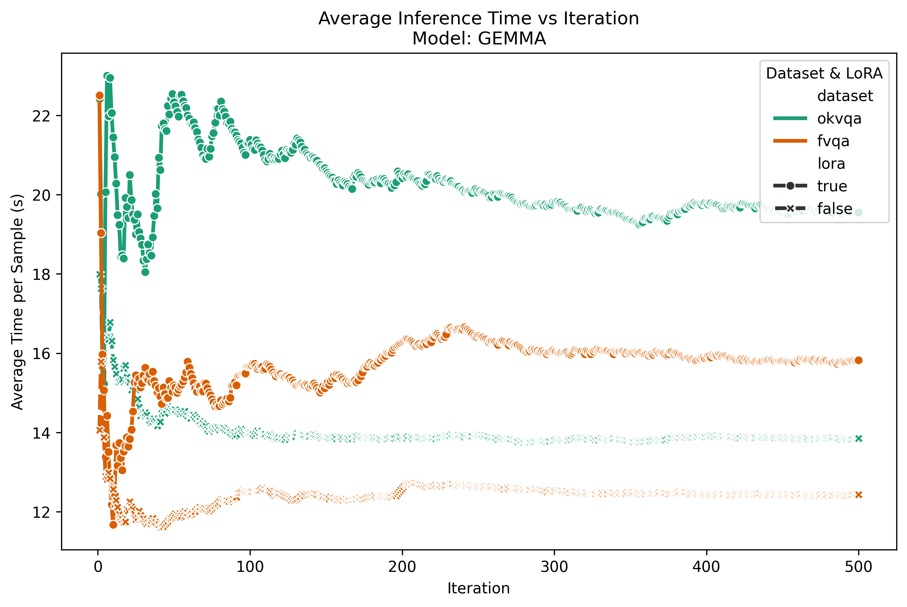
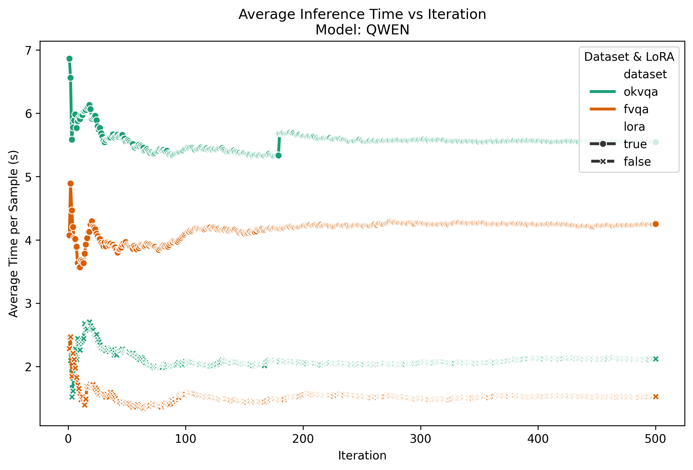

# 模型准确率对比
## OKVQA

### 闭源先进模型：gemini2.5-flash:4132/5046，正确率81.89%。
### gpt-4o：4013/5046，正确率79.53%
### gemini2.5-pro:4147/5046,正确率82.18%
### 开源先进模型：inclusionAI/M2-Reasoning,yes,prompt：4067 / 5046， 正确率确率80.60%。no prompt:4360 /5046,86.41%

### gemma3-12b,yes prompt(en),3719 / 5046,73.70%

### **基座模型：qwen**

| 方法                    | 准确数量 / 总数   | 准确率    | 相比 Baseline 提升（百分点） | 相比 Baseline 提升百分比 |
|-----------------------|-------------|--------|---------------------|-------------------|
| Baseline :未加systemtokn | 3802 / 5046 | 75.35% | —                   | —                 |
| 未训练 +systemtoken      | 3978 / 5046 | 78.83% | +3.48 pp            | +4.62%            |
| 训练集训练                 | 3830 / 5046 | 75.90% | +0.55 pp            | +0.57%            |
| vRoG 方法               | 4289 / 5046 | 84.99% | +9.64 pp            | +12.80%           |
| ROG训练方法               | 3974 / 5046 | 78.75% | +3.40 pp            | +4.52%            |
| vROG训练方法2             | 4550 / 5046 | 90.17% | +14.82 pp           | +19.67%           |
| vROG训练方法3             | 4702 / 5046 | 93.18% | +17.83 pp           | +23.67%           |

### **基座模型：gemma**

| 方法                          | 准确数量 / 总数   | 准确率    | 相比 Baseline 提升（百分点） | 相比 Baseline 提升百分比 |
|-----------------------------|-------------|--------|---------------------|-------------------|
| Baseline（未训练未加systemtokens） | 3927 / 5046 | 77.82% | —                   | —                 |
| 未训练 + systemtokens          | 3868 / 5046 | 76.66% | -1.16 pp            | -1.49%            |
| 训练（普通 LoRA）                 | 3501 / 5046 | 69.38% | -8.44 pp            | -10.85%           |
| 训练v2                        | 3689 /5046  | 73.11% | -4.71pp             | -6.05%            |
| vRoG 方法                     | 4031 / 5046 | 79.89% | +2.07 pp            | +2.66%            |
| ROG训练方法               | 4028 / 5046 | 79.83  | +2.01 pp            | +2.57%            |
| vROG训练方法3                   | 4654 / 5046 | 92.23% | +14.41 pp           | +18.51%           |

### **基座模型：llama**

| 方法                          | 准确数量 / 总数   | 准确率    | 相比 Baseline 提升（百分点） | 相比 Baseline 提升百分比 |
|-----------------------------|-------------|--------|---------------------|-------------------|
| Baseline（未训练未加systemtokens） | 3543 / 5046 | 70.21% | —                   | —                 |
| 未训练 + systemtokens          | 3576 / 5046 | 70.87% | +0.66 pp            | +0.94%            |
| 训练（普通 LoRA）                 | 3458 / 5046 | 68.53% | -1.68 pp            | -2.39%            |
| 训练v2                        | 3673 /5046  | 72.79% | +2.58               | +3.67%            |
| vRoG 方法                     | 3702 / 5046 | 73.36% | +3.15 pp            | +4.49%            |
| ROG训练方法               | 3844 / 5046 | 76.18% | +5.97 pp            | +8.49%            |
| vROG训练方法3                   | 4676 / 5046 | 92.67% | +22.46pp            | 31.98%            |
| vrog_en3                    | 4663 / 5046 | 92.41% | +22.21pp            | 31.63%            |

相同的基座模型llama3.2-11b,[llama-cot](https://github.com/PKU-YuanGroup/LLaVA-CoT)的结果为：

3968/5046，准确率: 78.64%  

---
## FVQA

fvqa, yes prompt, M2
✅ 正确数: 869 / 总数: 1165
🎯 准确率: 74.59%

fvqa, no prompt, M2
✅ 正确数: 845 / 总数: 1165
🎯 准确率: 72.53%

fvqa, gemini-2.5-pro, 
✅ 正确数: 855 / 总数: 1165
🎯 准确率: 73.39%

fvqa, gemini-2.5-flash, 
✅ 正确数: 868 / 总数: 1165
🎯 准确率: 74.51%

fvqa, gpt-4o
✅ 正确数: 843 / 总数: 1165
🎯 准确率: 72.36%

fvqa, internVL3-78b
✅ 正确数: 827 / 总数: 1165
🎯 准确率: 70.99%

fvqa, qwen2.5-72b
✅ 正确数: 884 / 总数: 1164
🎯 准确率: 75.95%

fvqa, gemma3-27b
✅ 正确数: 895 / 总数: 1165
🎯 准确率: 76.82%

llava cot,fvqa:
914 /  1165, 准确率: 78.45%

### qwen
qwen直接运行：正确数: 4169 / 总数: 5822 ，准确率: 71.61%

qwen在OKVQA上训练集训练出来的lora:正确数: 3724 / 总数: 5822， 准确率: 63.96%

qwen在OKVQA上用vrog方法3训练出来的lora：4779 / 总数: 5822, 准确率: 82.09%

qwen,yes prompt: 869 /  1164, 准确率: 74.66%

qwen,vrog方法： 929 /  1165, 准确率: 79.74%

qwen vrog2： 883 /  1165,准确率: 75.79%

qwen rog, 941 /  1165, 准确率: 80.77%

qwen以4:1（train:val=4658:1164）以vrog方法3训练出来的lora:964 / 总数: 1164,准确率：82.82%

qwen以4:1（train:val=4658:1164）直接训练出来的lora:861/1165,73.91%


### gemma

gemma,no prompt: 823 /  1165, 准确率: 70.64%

gemma3-12b, yes prompt, , 正确数: 1736 / 总数: 2330, 准确率: 74.51%

gemma,rog 928 /  1165, 准确率: 79.66%

gemma，vrog方法： 805 /  1165, 准确率: 69.10%

gemma vrog2, 868 /  1165,准确率: 74.51%

gemma以4:1（train:val=4658:1164）以vrog方法3训练出来的lora: 947 /  1181, 准确率: 80.19%

gemma以4:1（train:val=4658:1164）直接训练出来的lora:859/1165,73.73%

gemma在okvqa以vrog3方法训练出来的： 946 /  1165, 准确率: 81.20%

### llama

fvqa, yes prompt, llama-11b,正确数: 737 / 总数: 1118, 准确率: 65.92%

fvqa, no prompt, llama-11b
✅ 正确数: 770 / 总数: 1165
🎯 准确率: 66.09%

llama,vrog方法： 840 /  1165, 准确率: 72.10%

llama ,rog, 932 /  1165, 准确率: 80.00%

llama vrog2训练方法: 899 /  1165,准确率: 77.17%

llama以4:1（train:val=4658:1164）以vrog方法3训练出来的lora: 947 /  1181, 准确率: 80.19%

llama以4:1（train:val=4658:1164）直接训练出来的lora:870/1165,74.68%

llama在okvqa以vrog3方法训练出来的： 933 /  1165, 准确率: 80.09%

---
## A-OKVQA

qwen直接运行：正确数: 986 / 总数: 1145，准确率: 86.11%

qwen在OKVQA上用vrog方法3训练出来的lora:正确数: 1046 / 总数: 1145,准确率: 91.35%

---

## 跨数据集

### vrog3方法

|模型|source|val| 结果                     |
|--|--|--|------------------------|
|qwen|okvqa|fvqa| 4779 /  5822, 准确率: 82.09% |
|qwen|fvqa|okvqa| 4312 / 5046,准确率: 85.45%     |
|gemma|okvqa|fvqa| 946 /  1165, 准确率: 81.20% |
|gemma|fvqa|okvqa| 4210/5046,准确率: 83.43%  |
|llama|okvqa|fvqa| 933 /  1165, 准确率: 80.09% |
|llama|fvqa|okvqa| 4016 / 5046,准确率: 79.59% |

### 从训练集直接训练

|模型|source|val| 结果                        |
|--|--|--|---------------------------|
|qwen|okvqa|fvqa|  717 /  1165, 准确率: 61.55% |
|qwen|fvqa|okvqa| 3406 /5046，准确率: 67.50%    |
|gemma|okvqa|fvqa| 678 /  1165, 准确率: 58.20% |
|gemma|fvqa|okvqa| 3225 /5046，准确率: 63.91%    |
|llama|okvqa|fvqa|  709 /  1165, 准确率: 60.86% |
|llama|fvqa|okvqa| 3239 /5046，准确率: 72.79%   |

---
# 模型推断用时测试
## 以下均是测试500条的结果

### 在fvqa上，不同的模型时间如下


### 在okvqa上，不同模型平均用时如下


### 对于llama模型，其在不同测试集以及是否是lora用时如下


### 对于gemma模型，其在不同测试集以及是否是lora用时如下

### 对于qwen模型，其在不同测试集以及是否是lora用时如下


---
# QUICK START

## 一、用户想要用ROG直接对验证集或者单个KQA问题进行处理

- 生成关系路径 `1.jsonl`
- 基于 `1.jsonl` 进行ROG预测，得到 `2.jsonl`

## 二、用户想获得一个能直接用ROG方法的模型


**步骤流程：**
1. 生成关系路径 `1.jsonl`
2. 基于 `1.jsonl` 进行ROG预测，得到 `2.jsonl`
3. 将 `2.jsonl` 转化为训练数据格式 `2_train.json`
4. 使用 `2_train.json` 对模型进行训练
5. 使用训练好的模型进行推断

---

# ROG方法改进

## 改进方案1：基础版ROG训练流程


该方案简单地将预测结果转化为训练数据并重新训练模型，但可解释性较差。

---

## 改进方案2：引入路径解释


此方案在基础之上增加了路径解释功能，并结合 Ground Truth 数据生成更高质量的训练样本。

---

## 改进方案3：多路径评分机制


本方案通过多路径生成与评分机制，提升了预测结果的多样性和准确性，并保证最终输出具有完整的路径解释。

---

# 快速开始指南 (Quickstart)

## 第0步：配置环境

```shell
conda env create --file environment.yml --name rog
conda activate rog
```

> **注意：** Flash Attention 可选安装，请参考其官方文档获取更多信息。

---

## 第一步：下载数据集并解压

```shell
pip install modelscope
modelscope download --dataset OmniData/OK-VQA --local_dir ./data
unzip ./data/*.zip
```

---

## 在此目录下运行推断代码

### 第一个脚本：生成关系路径（仅关键词）

请根据需要调整参数：

```shell
bash ./scripts/planning.sh 
```

### 第二个脚本：生成对应关系路径的推理结果

输入文件必须是上一步的输出文件：

```shell
bash ./scripts/rog-reasoning.sh
```

---

## 在此目录下进行ROG方法的模型训练

### 步骤1：生成关系路径（用于训练模式）

请根据需要调整参数并启用训练模式：

```shell
bash ./scripts/planning.sh 
```

### 步骤2：生成推理结果

输入文件必须是上一步的输出文件：

```shell
bash ./scripts/rog-reasoning.sh
```

### 步骤3：生成可用于训练的数据集

请修改文件路径以匹配上一步的输出文件：

```shell
python ./src/finetuning/generate.py
```

### 步骤4：进行模型训练

```shell
bash ./src/finetuning/train.sh
```

完成训练后，你将获得一个经过ROG训练的模型。

---

### 使用训练好的模型进行推理（可选）

可以直接使用如下命令进行验证：

```shell
python ./validatelora.py
```

---


|method| 多模态的prompt | 生成多种路径的评分机制 | 多模态 |
|--|------------|-------------|-----|
ROG| 1          | 1           | 0   |
vrog|0|0| 1   
vrog2| 1          | 0           | 1   |
vrog3| 1          | 1           | 1   |

prompt:rog或者vrog的关于生成关系路径和预测的提示词
